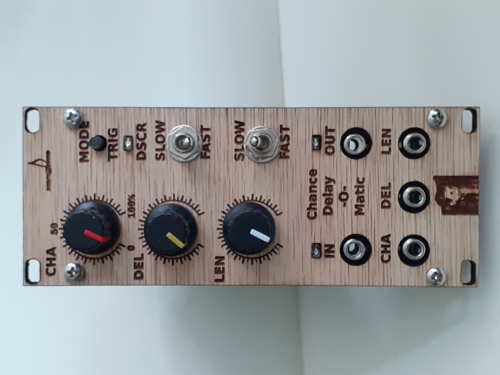

Chance-Delay-O-Matic
-

This is Chance-Delay-O-Matic by Sculpt-O-Sound

This module will copy gate signals from its input to its output and either change their length, delay them or only copy them by chance.

It has 2 operating modes. In continuous mode the delay time and gate length can be set on a continuous scale,
very short (a few milliseconds) and very long (20 seconds) delays are possible. In discrete mode (default mode) the incoming
pulse is regarded as a clock and the values are quantised to that clock. Amongst others this makes it easy to set a delay that is related
to the speed of the clock/gate received. The code for this module was written (in May 2024) and the hardware was designed (in Nov 2023) by myself. I got the idea for designing this module after watching a demo video by RJH Synth.